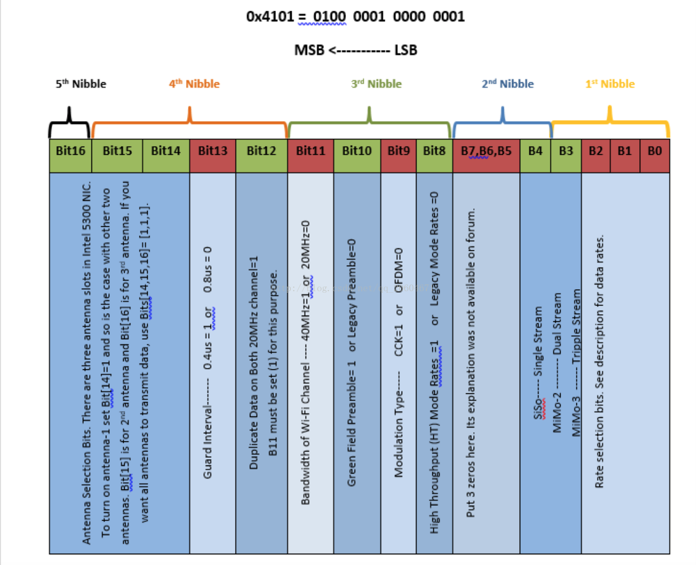

Thanks to [Dan](http://r.halper.in/work)'s great efforts, the Channel State Information(CSI) can be accessed on Intel 5300 WiFi chips. However, their are still many annoying problems in practical use. This page includes some problems I encountered and summarize solutions. 

First of all, it is quite difficult to install and use the fireware correctly for people who is new to this tool. There are several common problems:

* Server hang off when clone the repository: Set proxy for the git client
* Network Unreachable in AP mode: 
```
sudo dhclient wlan0
``` 
* RFKill problem: 
```
sudo rfkill unblock all
```
* Device or resource busy: Retry the shell script or reboot the system


Use Monitor Mode
```
sudo apt-get install libpcap-dev
git clone https://github.com/dhalperi/lorcon-old.git
cd lorcon-old
./configure
make
sudo make install
cd linux-80211n-csitool-supplementary/injection
make
```

In the receiver
```
sudo sh setup_monitor.sh 60 HT20 
sudo ../netlink/log_to_file log.dat
```

In the transmitter
```
sudo sh setup_inject.sh 60 HT20
sudo echo 0x4101 |sudo tee /sys/kernel/debug/ieee80211/phy0/iwlwifi/iwldvm/debug/monitor_tx_rate
sudo ./random_packets 1 100 1 1000
```

The meaning of 0x4101 is shown in the figure below.



